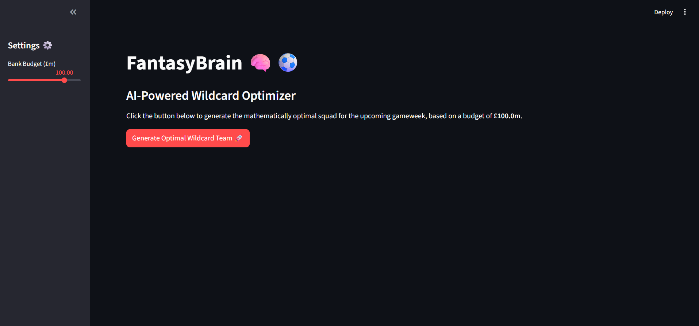
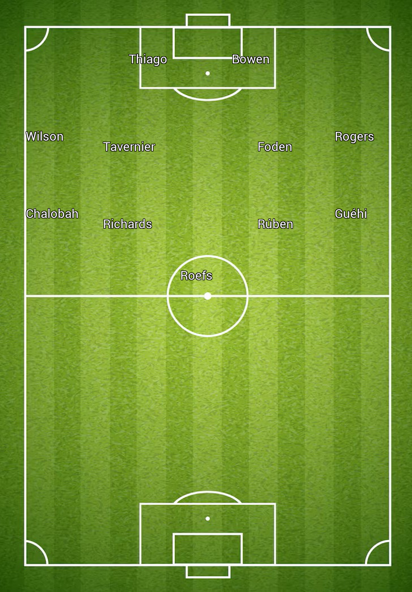

# FantasyBrain 🧠⚽
### The AI-Powered Assistant for Fantasy Premier League


> **"Why guess when you can calculate?"**

## 📖 About The Project

I got tired of stressing over my FPL team every Weekend, relying on gut feelings and biased YouTube pundits. So, I decided to retire from manual management and let algorithms take the wheel.

**FantasyBrain** is an end-to-end Python application that automates the decision-making process. It treats FPL like a mathematical optimization problem (specifically, the **Knapsack Problem**), finding the combination of players that maximizes projected points while strictly adhering to budget and formation constraints.

## 📸 Demo



## 🚀 Key Features

* **Real-Time Data ETL:** Fetches live stats, injuries, and fixture difficulty ratings directly from the official Premier League API.
* **"Genius Score" Algorithm:** A custom metric that ranks players based on:
    * Current Form 📈
    * Fixture Difficulty (FDR) 🛡️
    * Expected Points (xP) 🔮
    * ROI (Points per Million) 💰
* **Linear Optimization:** Uses the `PuLP` solver to construct the mathematically optimal 15-man squad. It considers:
    * Total Budget (e.g., £100m).
    * Max 3 players per team.
    * Valid formation constraints (2 GKP, 5 DEF, 5 MID, 3 FWD).
* **Interactive UI:** Built with **Streamlit** to allow users to adjust budgets and visualize results instantly.
* **Pitch Visualization:** Dynamically generates an image of the starting XI on a football pitch using `Pillow`.

## 🛠️ Tech Stack

* **Python** (Core Logic)
* **Pandas** (Data Cleaning & Manipulation)
* **Streamlit** (Frontend Web Interface)
* **PuLP** (Linear Programming / Optimization)
* **Requests** (API Handling)
* **Pillow (PIL)** (Image Processing)

## ⚙️ How to Run Locally

Want to find the optimal team for yourself? Follow these steps:

1.  **Clone the repository:**
    ```bash
    git clone [https://github.com/YOUR_USERNAME/FantasyBrain.git](https://github.com/hayek-moran/FantasyBrain.git)
    cd FantasyBrain
    ```

2.  **Install dependencies:**
    ```bash
    pip install -r requirements.txt
    ```

3.  **Run the App:**
    ```bash
    streamlit run main.py
    ```

4.  **Enjoy!** The app will open in your browser at `http://localhost:8501`.

## 🧠 How It Works (The Math)

The core of this project is a **Linear Programming** model.
We define $x_i$ as a binary variable (0 or 1) for each player. We want to maximize:

$$ \sum (GeniusScore_i \times x_i) $$

Subject to constraints:
* $\sum Cost_i \times x_i \leq Budget$
* $\sum x_i = 15$
* Position limits (e.g., $\sum GKP = 2$)
* Team limits (e.g., $\sum Arsenal \leq 3$)

## 🤝 Contributing

Contributions are welcome! If you have ideas for better weighing algorithms or new features, feel free to fork the repo and submit a pull request.

## 📬 Author

**Mano Hayek**
* [LinkedIn](https://www.linkedin.com/in/linkedin.com/in/moran-hayek)
* [GitHub](https://github.com/hayek-moran)

---
*Disclaimer: I am not responsible if Pep rotates your captain at the last minute. The AI is smart, but Pep is unpredictable.* 😂